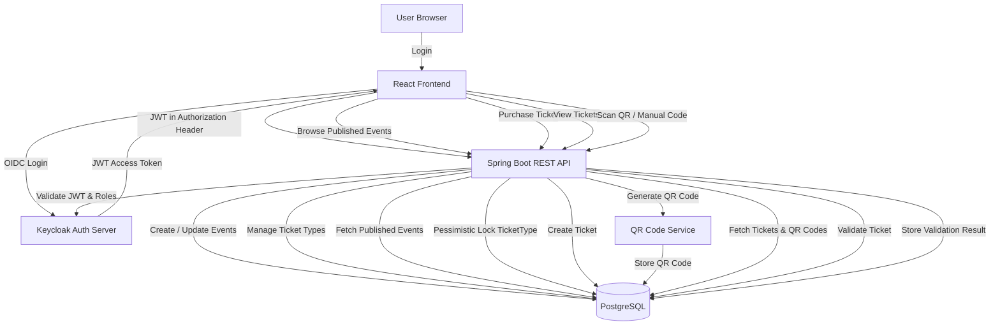

# 🎟️ Event Ticket Platform [TIXERA]

A **full-stack event ticketing platform** that allows organizers to create and manage events, attendees to purchase tickets, and staff to validate tickets using QR codes — all secured with **Keycloak** and **JWT authentication**.

---

## 🔄 System Flow Diagram



---

## 🚀 Features

### 👤 User Roles (Keycloak)

* **Organizer**

  * Create, update, publish, and delete events
  * Manage ticket types
  * View and manage owned events
* **Attendee**

  * Browse and search published events
  * Purchase tickets
  * View owned tickets & QR codes
* **Staff**

  * Validate tickets (QR code or manual entry)

---

### 🎫 Ticketing System

* Multiple ticket types per event
* Secure ticket purchasing with **pessimistic locking**
* QR code generation per ticket
* Manual & QR-based ticket validation
* Prevents duplicate validation

---

### 🔐 Security

* Keycloak for authentication & authorization
* JWT-based stateless API security
* Role-based endpoint access
* Custom JWT role converter

---

### 🔍 Event Discovery

* List published events
* Full-text search (PostgreSQL `tsvector`)
* Public event browsing without authentication

---

### 🖥️ Frontend

* Modern React UI
* Role-based dashboards
* QR code scanning
* Responsive & clean design

---

## 🧱 Architecture

### Backend

* **Java 21**
* **Spring Boot**
* Spring Data JPA
* Spring Security (OAuth2 Resource Server)
* MapStruct
* PostgreSQL
* H2 (testing)
* ZXing (QR code generation)

### Frontend

* **React 19**
* **Vite**
* TypeScript
* Tailwind CSS
* Radix UI
* React Router
* OIDC (Keycloak)
* QR Scanner

### Auth & Infrastructure

* **Keycloak**
* Docker & Docker Compose

---

## 🗂️ Domain Model

The platform models:

* Users (Organizer / Attendee / Staff)
* Events
* Ticket Types
* Tickets
* QR Codes
* Ticket Validations

Relations include:

* One organizer → many events
* One event → many ticket types
* One user → many tickets
* One ticket → one QR code → many validations

---

## 📸 QR Code Flow (Generation & Validation)

### 🎟️ Ticket QR Code (Generated After Purchase)


Each purchased ticket generates a **unique QR code**, stored in the database and linked to the ticket.

---

### ✅ Valid Ticket Scan


* Ticket is valid
* Not previously used
* Validation recorded in the database

---

### ❌ Invalid / Already Used Ticket


* Invalid QR code
* Already validated
* Rejected by backend validation rules

---

## 📦 Backend API Overview

### Events

```
GET    /api/v1/events
POST   /api/v1/events
GET    /api/v1/events/{id}
PUT    /api/v1/events/{id}
DELETE /api/v1/events/{id}
```

### Published Events (Public)

```
GET /api/v1/published-events
GET /api/v1/published-events/{id}
GET /api/v1/published-events/search
```

### Tickets

```
POST /api/v1/events/{eventId}/ticket-types/{ticketTypeId}/tickets
GET  /api/v1/tickets
GET  /api/v1/tickets/{ticketId}
GET  /api/v1/tickets/{ticketId}/qr-codes
```

### Ticket Validation

```
POST /api/v1/ticket-validations
```

---

## 🐳 Docker Setup

### Services

* PostgreSQL (no volume → easy reset)
* Adminer
* Keycloak (with persistent volume)

### Start Infrastructure

```bash
docker compose up -d
```

---

## 🧪 Validation & Error Handling

* DTO-based validation
* Centralized `@RestControllerAdvice`
* Consistent error response format
* Safe Optional handling in service layer

---

## 🧩 Key Design Decisions

* DTOs for **every request & response**
* Stateless REST API
* Pessimistic locking for ticket purchase safety
* Orphan removal for ticket types
* Separate published vs organizer event flows
* MapStruct for clean mapping
